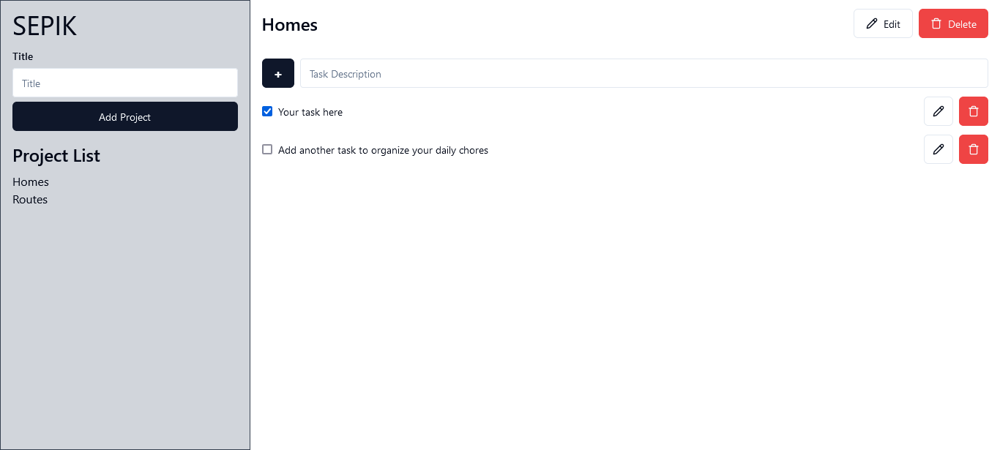

# Bearmentor Month 3 Project Repository



## Description

Sepik is very barebone and simplified todo web, with very simple functionality to add and delete todo yet clean, intuitive, and easy-to-use. Application is deployed and can be accessed at: [sepik-task-management.vercel.app](sepik-task-management.vercel.app)

## Functionality

-   Add, edit, and delete projects.
-   Add, edit, and delete tasks.
-   In each tasks:
    -   [TODO] Set due date (default value: today)
    -   Set status by checklist (default value: false/not checked)

## Stories

-   Users have ability to add arbitrary number of projects
-   Users have ability to add arbitrary number of tasks to a project.
    -   Each project can have arbitrary number of tasks.
-   Users can checklist any tasks

## Installation

Clone repository to your local machine using Git:

```bash
git clone git@github.com:deppfellow/month-3-todo.git
cd month-3-todo/
npm install
```

Then, start the development server

```bash
npm run dev
```
